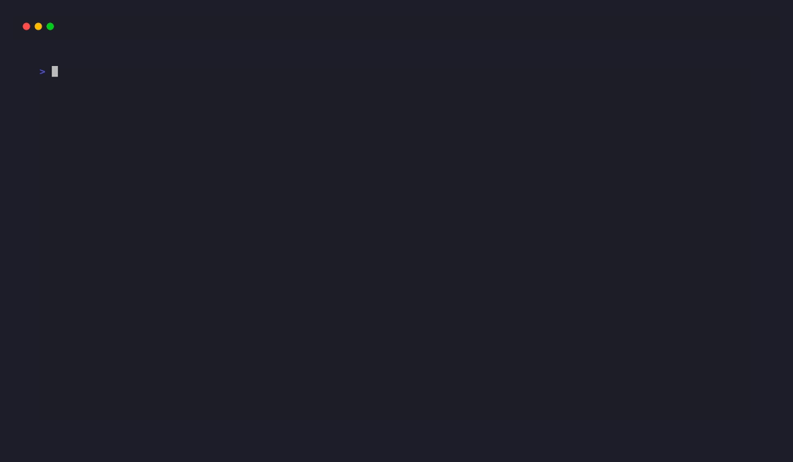

<div align="center">

# TicketLens

<div align="center">
  
  
  
  
  
</div>

</div>

> Your AI assistant shouldn't need to read your tickets.

<div align="center"></div>

---

## What is TicketLens?

TicketLens is a local-first Jira CLI that preprocesses ticket context on your machine and hands your AI tools a clean, compressed brief — instead of dumping raw Jira API JSON into your session. It supports Jira Cloud, Server, and Data Center, works with any AI tool that accepts text, and runs independently of any AI session.

Zero npm dependencies. Node.js built-ins only.

---

## Why TicketLens?

- **Privacy** — ticket content never leaves your machine; no cloud relay, no data sent to Anthropic or anyone else
- **60–80% token savings** — structured briefs instead of verbose Jira JSON; 4-hour cache by default
- **Scriptable** — standard CLI output: pipe to cron, git hooks, CI/CD, or any LLM tool
- **Multi-profile** — connect multiple Jira instances simultaneously; auto-route by ticket prefix or project path
- **Attachments included** — images, PDFs, and text files downloaded locally; Claude Code reads them as context

---

## Quick Start

```bash
npm install -g ticketlens
ticketlens init          # Guided setup: Jira URL, auth type, connection test
ticketlens CNV1-2        # Fetch a ticket brief
ticketlens triage        # Scan your assigned tickets
```

Or without installing:

```bash
npx ticketlens init
npx ticketlens CNV1-2
```

**Prerequisites:** Node.js >=18

---

## Demos

<div align="center"></div>

---

## Commands

### Setup

| Command | Description |
|---------|-------------|
| `ticketlens init` | Guided wizard — Jira URL, auth, live connection test, optional settings |
| `ticketlens switch` | Arrow-key panel to switch between configured profiles |
| `ticketlens config [--profile=NAME]` | Edit any field on an existing profile |
| `ticketlens profiles` | List all configured profiles (alias: `ticketlens ls`) |
| `ticketlens delete <NAME>` | Remove a profile and its credentials |

`init` collects: profile name, Jira URL (bare hostnames accepted — HTTPS probed first), auth type (auto-detected from URL), credentials (masked), and optional ticket prefixes, project paths, and triage statuses. On connection failure, a retry menu lets you fix credentials, URL, or skip — all inputs pre-populated.

`config` uses merge semantics: new ticket prefixes and triage statuses are added to existing lists, never replaced. Partial matching resolves `QA` to `QA Testing` if that's the status in your Jira.

---

### Fetch a ticket

```bash
ticketlens CNV1-2                  # Depth 1, styled output (default)
ticketlens get CNV1-2              # Same — explicit alias
ticketlens CNV1-2 --depth=0        # Target ticket only
ticketlens CNV1-2 --depth=1        # + linked ticket descriptions and comments
ticketlens CNV1-2 --depth=2        # + linked-of-linked [Pro]
ticketlens CNV1-2 --plain          # Plain markdown — pipe-safe, LLM-ready
ticketlens CNV1-2 --profile=acme   # Force a specific profile
ticketlens CNV1-2 --no-cache       # Bypass cache, re-fetch from Jira
ticketlens CNV1-2 --no-attachments # Skip attachment download
```

| `--depth` | Scope |
|-----------|-------|
| `0` | Target ticket: description, comments, attachments |
| `1` | + linked tickets: descriptions and comments _(default)_ |
| `2` | + linked-of-linked: key and summary only _(Pro)_ |

Max 15 tickets at any depth. Circular references handled automatically.

After the first fetch, ticket data is cached to `~/.ticketlens/cache/PROFILE/TICKET-KEY/brief.json` (4h TTL, depth-aware). A dim notice appears on stderr on cache hit:

```
  ○ CNV1-2 · from cache (12m ago)  ·  --no-cache to refresh
```

Attachments download to `~/.ticketlens/cache/TICKET-KEY/` (10 MB per-file cap). Claude Code reads images multimodally, extracts PDF text, and reads plain text files as context.

---

### Triage

```bash
ticketlens triage                               # Scan assigned tickets — interactive
ticketlens triage --profile=acme               # Explicit profile
ticketlens triage --stale=3                    # Aging threshold: 3 days (default: 5)
ticketlens triage --status="Code Review,QA"    # Override statuses to scan
ticketlens triage --assignee="Jane Dev"        # Another dev's tickets [Team]
ticketlens triage --sprint="Sprint 12"         # Filter by sprint [Team]
ticketlens triage --plain                      # Plain markdown — pipe to file or LLM
ticketlens triage --static                     # Static table, no interactive mode
```

| Badge | Category | Condition |
|-------|----------|-----------|
| `●` red | Needs response | Someone else commented within the last N days |
| `●` yellow | Aging | Last comment or update is N+ days old |

`--stale=N` controls both categories. Unanswered comments older than N days downgrade from "needs response" to "aging" automatically.

Interactive mode: `↑/↓` navigate, `Enter` open in browser, `p` switch profile, `q/Esc` exit. Columns adapt to terminal width.

Status mismatch auto-fix: if configured statuses don't match Jira's exact casing, triage shows a diff and offers to update your profile:

```
  ~ In progress  →  In Progress
  ~ QA           →  QA Testing

  Update "myteam" with corrected statuses?  y/N
```

Bot comments (Jira Automation, Jenkins, GitHub Actions) are automatically ignored.

---

### Cache

```bash
ticketlens cache size                          # Disk usage by profile and ticket
ticketlens cache size --profile=acme           # Filter to one profile
ticketlens cache clear                         # Interactive picker (TTY)
ticketlens clear                               # Alias for cache clear
ticketlens cache clear CNV1-2                  # Clear one ticket
ticketlens cache clear --older-than=7d         # Files older than 7 days
ticketlens cache clear --profile=acme          # One profile's files only
ticketlens cache clear --older-than=30d --yes  # Skip confirmation (CI/scripts)
```

Age units: `d` = days · `m` = months (30d) · `y` = years (365d)

Cache locations:
- Attachments: `~/.ticketlens/cache/TICKET-KEY/`
- Briefs: `~/.ticketlens/cache/PROFILE/TICKET-KEY/brief.json`

---

### License

```bash
ticketlens license                # Show tier and status
ticketlens activate <KEY>         # Activate a Pro or Team license
```

---

### /jtb — Jira TicketBrief for Claude Code

`/jtb` is a Claude Code slash command that fetches full ticket context and drops a structured implementation brief directly into your session, then enters plan mode.

> Requires [Claude Code](https://claude.ai/code). For standalone use, the `ticketlens` commands above work independently.

**Install:**

```bash
npm install -g ticketlens && ticketlens init
cp $(npm root -g)/ticketlens/skills/jtb/SKILL.md ~/.claude/commands/jtb.md
# Restart Claude Code, then:
# /jtb CNV1-2
```

**Usage in Claude Code:**

```
/jtb CNV1-2                    # Fetch ticket + linked issues → plan mode
/jtb CNV1-2 --depth=0          # Target ticket only (fast)
/jtb CNV1-2 --depth=2          # Deep: linked-of-linked [Pro]
/jtb CNV1-2 --profile=acme     # Force a specific profile
/jtb CNV1-2 --no-attachments   # Skip attachment download
/jtb CNV1-2 --no-cache         # Re-fetch from Jira
/jtb triage                    # Scan your assigned tickets
```

Attachments are listed in the brief as absolute paths. Claude Code reads images (multimodal), PDFs, and text files before planning. Files over 10 MB are skipped.

---

## All Examples

```bash
# ── Setup ────────────────────────────────────────────────────────────────────
ticketlens init                               # Guided wizard (recommended)
ticketlens switch                             # Switch between configured profiles
ticketlens config                             # Edit the active profile
ticketlens config --profile=acme             # Edit a specific profile
ticketlens profiles                           # List all configured profiles
ticketlens ls                                 # Alias for profiles
ticketlens profiles --plain                   # Tab-separated (scripts / pipes)
ticketlens delete <PROFILE-NAME>              # Remove a profile (prompts y/N in TTY)

# ── Fetch a ticket brief ──────────────────────────────────────────────────────
ticketlens CNV1-2                            # Fetch with defaults (depth 1, styled)
ticketlens get CNV1-2                        # Explicit alias (same result)
ticketlens CNV1-2 --depth=0                  # Target ticket only — no linked issues
ticketlens CNV1-2 --depth=1                  # + linked ticket descriptions and comments
ticketlens CNV1-2 --depth=2                  # + linked-of-linked (Pro)
ticketlens CNV1-2 --profile=acme             # Force a specific Jira profile
ticketlens CNV1-2 --plain                    # Plain markdown — no color codes
ticketlens CNV1-2 --styled                   # Force ANSI color even when piping
ticketlens CNV1-2 --no-attachments           # Skip attachment download entirely
ticketlens CNV1-2 --no-cache                 # Skip brief cache + force re-download
ticketlens CNV1-2 --depth=2 --profile=acme --plain   # Combine flags freely

# Pipe plain output to clipboard, LLM, or file
ticketlens CNV1-2 --plain > brief.md
ticketlens CNV1-2 --plain | pbcopy
ticketlens CNV1-2 --plain | llm "Summarize this ticket in 3 bullets"

# ── Triage ────────────────────────────────────────────────────────────────────
ticketlens triage                             # Scan assigned tickets — interactive
ticketlens triage --profile=acme             # Explicit profile
ticketlens triage --stale=3                  # Needs-response window: 3 days (default: 5)
ticketlens triage --stale=10                 # More lenient — only flag very stale tickets
ticketlens triage --status="Code Review,QA Testing"  # Scan these statuses only
ticketlens triage --static                   # Static table output (no interactive mode)
ticketlens triage --plain                    # Plain markdown — pipe to LLM or file
ticketlens triage --assignee="Jane Dev"      # View another dev's tickets [Team]
ticketlens triage --sprint="Sprint 12"       # Filter by sprint name [Team]
ticketlens triage --assignee="Jane Dev" --sprint="Sprint 12"  # Combined [Team]
ticketlens triage --profile=acme --stale=3 --static          # Combine flags

# Pipe triage output
ticketlens triage --plain > my-tickets.md
ticketlens triage --plain | llm "Which ticket is most urgent and why?"

# ── Cache management ──────────────────────────────────────────────────────────
ticketlens cache                              # Overview + subcommand hints
ticketlens cache --help                       # Detailed help
ticketlens cache size                         # Disk usage by profile and ticket
ticketlens cache size --profile=acme          # Filter to one profile only
ticketlens cache clear                        # Interactive picker (TTY)
ticketlens clear                              # Alias for cache clear
ticketlens cache clear CNV1-2                # Clear one ticket's cache
ticketlens cache clear --older-than=7d        # Files older than 7 days
ticketlens cache clear --older-than=1m        # Files older than 1 month
ticketlens cache clear --older-than=1y        # Files older than 1 year
ticketlens cache clear --profile=acme         # Only one profile's files
ticketlens cache clear CNV1-2 --older-than=7d            # Ticket + age filter
ticketlens cache clear --profile=acme --older-than=30d   # Profile + age filter
ticketlens cache clear --older-than=30d --yes            # Skip confirmation (CI/scripts)

# ── License and account ────────────────────────────────────────────────────────
ticketlens license                            # Show license tier and status
ticketlens activate <LICENSE-KEY>             # Activate a license key
ticketlens schedule                           # Scheduled digest setup [Pro]

# ── Help and version ──────────────────────────────────────────────────────────
ticketlens --help                             # Main help
ticketlens --version                          # Show installed version
ticketlens CNV1-2 --help                     # Fetch subcommand help
ticketlens triage --help                      # Triage subcommand help
ticketlens cache --help                       # Cache overview help
ticketlens cache size --help                  # Cache size help
ticketlens cache clear --help                 # Cache clear help
```

---

## Pro & Teams Features

Start free, upgrade when you need it — `ticketlens activate <key>`

### Pro — $8/mo

<div align="center">
  
</div>

```bash
ticketlens CNV1-2 --depth=2          # Deep traversal: linked-of-linked tickets
ticketlens triage --stale=3          # Custom stale threshold (default is 5)
ticketlens activate YOUR-LICENSE-KEY # Activate Pro license
```

<div align="center">
  
</div>

Pro also unlocks configurable brief cache TTL per profile — set `cacheTtl` to `4h`, `1d`, `7d`, `30d`, or `0` (disable) via `ticketlens config`. Free tier is fixed at 4h.

### Team — $15/seat/mo

<div align="center">
  
</div>

```bash
ticketlens triage --export=csv       # Export triage to CSV for standups and reports (coming soon)
ticketlens triage --export=json      # Machine-readable export for dashboards (coming soon)
```

Automate a morning digest with cron — no open terminal required:

```bash
0 9 * * 1-5 ticketlens triage --plain > ~/digest-$(date +%F).md
```

Multi-profile team workflows: each teammate runs `ticketlens init` with their own credentials; shared `ticketPrefixes` auto-route tickets to the right Jira instance.

---

## Multi-Profile Setup

Profiles live in `~/.ticketlens/profiles.json`:

```json
{
  "profiles": {
    "myteam": {
      "baseUrl": "https://myteam.atlassian.net",
      "auth": "cloud",
      "email": "you@myteam.com",
      "ticketPrefixes": ["PROJ", "OPS"],
      "projectPaths": ["~/projects/myteam-app"],
      "triageStatuses": ["In Progress", "Code Review", "QA Testing"]
    },
    "client": {
      "baseUrl": "https://jira.client.com",
      "auth": "server",
      "email": "yourname",
      "ticketPrefixes": ["ACME", "SHOP"],
      "projectPaths": ["~/projects/client-app"],
      "triageStatuses": ["In Progress", "In Development", "QA"]
    }
  }
}
```

Credentials in `~/.ticketlens/credentials.json` (chmod 600):

```json
{
  "myteam": { "apiToken": "your-atlassian-api-token" },
  "client":  { "pat": "your-jira-server-pat" }
}
```

**Profile resolution order:**

| Priority | Method | Example |
|----------|--------|---------|
| 1 | `--profile=NAME` flag | `ticketlens CNV1-2 --profile=client` |
| 2 | Ticket prefix match | `ticketlens CNV1-2` → prefix `PROJ` → `myteam` |
| 3 | Project path match | `triage` in `~/projects/myteam-app` → `myteam` |
| 4 | First profile in file | Default when nothing else matches |
| 5 | Environment variables | `JIRA_BASE_URL`, `JIRA_EMAIL`, `JIRA_API_TOKEN` / `JIRA_PAT` |

---

## Running Tests

```bash
npm test
```

---

## Roadmap

See [ROADMAP.md](ROADMAP.md) for the full plan.

Coming up:
- AI ticket summary and compliance check (Pro)
- Scheduled triage digest — server-side, no open terminal (Pro)
- Team triage dashboard and Slack/Teams alerts (Team)
- Triage CSV/JSON export (Team)
- GitHub Issues and Linear support

---

## Contributing

Bug reports and feature requests welcome — open an issue on [GitHub](https://github.com/ralphmoran/ticket-lens/issues). For larger changes, open an issue first to discuss.

---

## License

[MIT](LICENSE) © Ralph Moran
